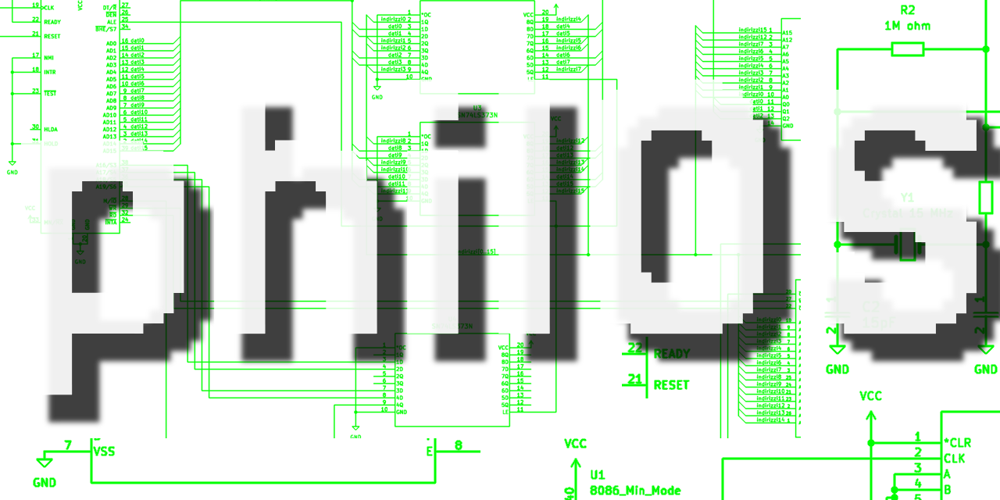
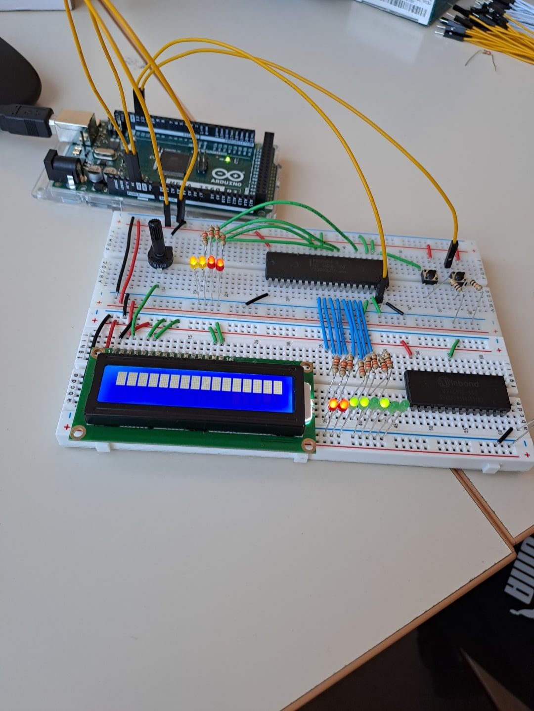
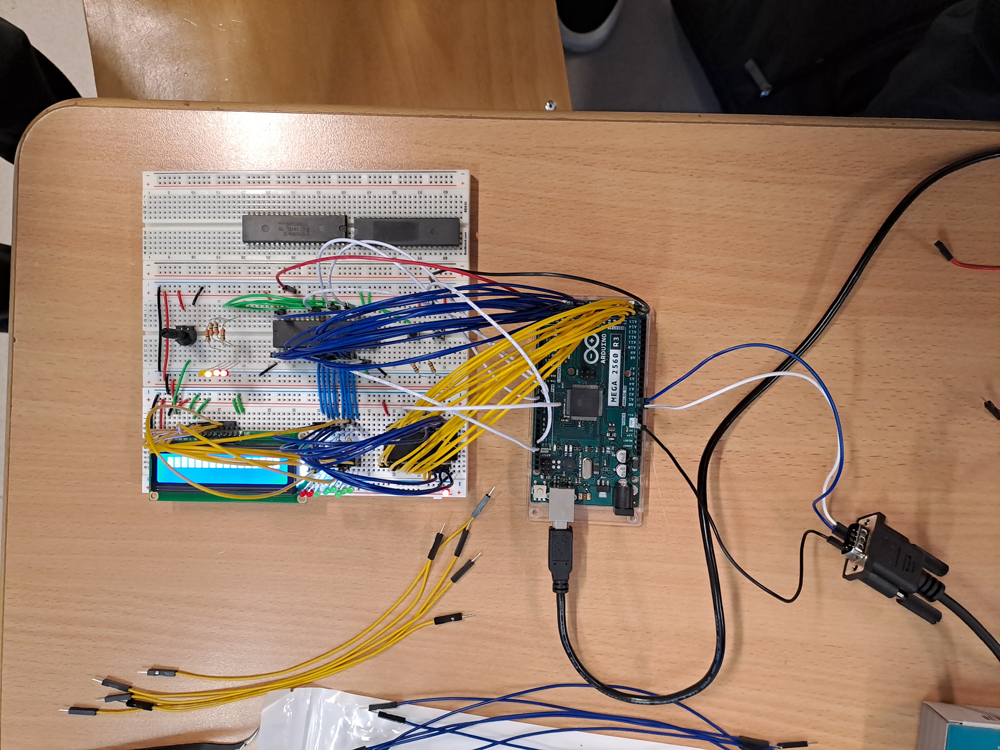
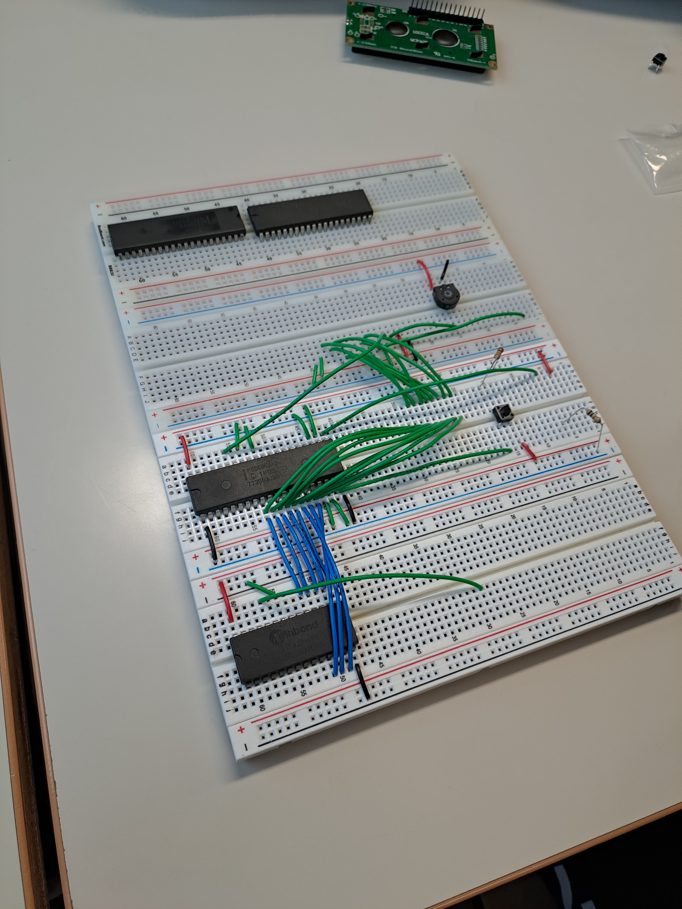
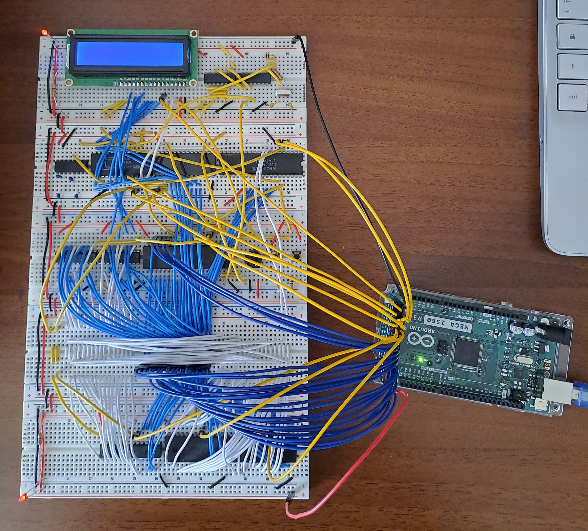
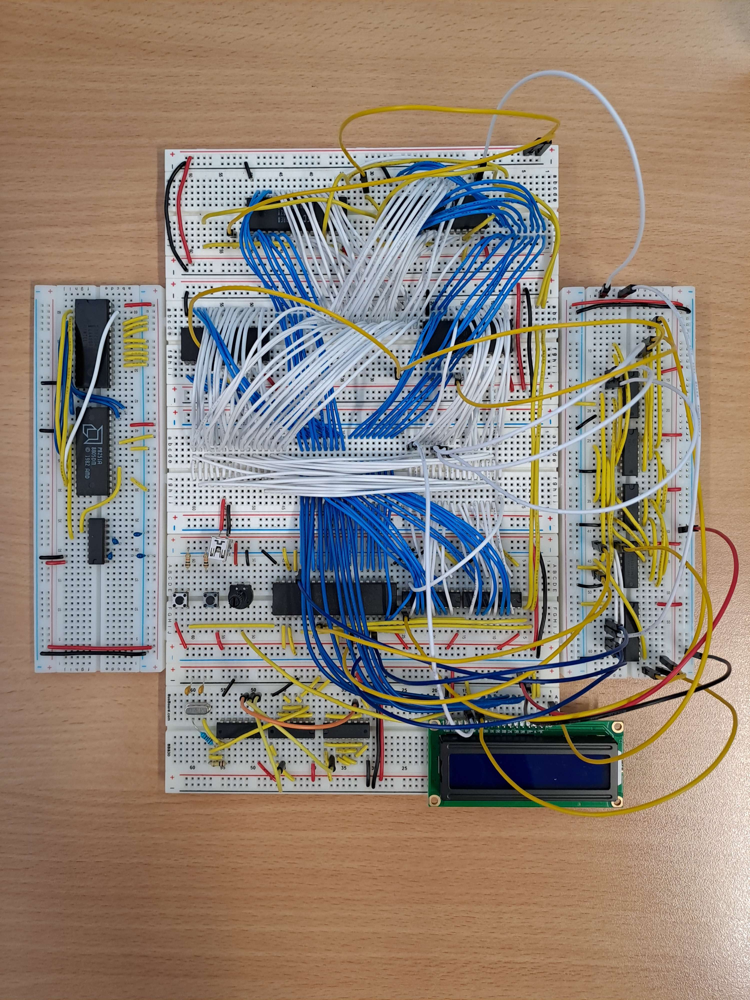

# `msg DB 'Welcome to philOS.', 0`

This repository contains both hardware diagrams and software code for a retro-computing-inspired system, built **entirely from scratch**.

## `INT 0x00 ; GET_GENERAL_INFO`

We named it **_philOS_**.

The software consists of a very simple **16-bit kernel**, several **user programs**, and a fully **custom BIOS**.

The hardware is built around the legendary **Intel 8086**, the 16-bit processor that gave life to the x86 architecture, along with **128 KiB of RAM** and **64 KiB of ROM**.

## `INT 0x01 ; GET_PURPOSE_N_HISTORY`

Started as a side hobby, later became our final-year exam project for high school.

Initially, we intended to develop only an operating system (hence the name), but we eventually decided to buy some chips and got to work on building the physical computer as well.

The project is still **work in progress**. There are many things left to implement and improve, however, the journey has taught us a great deal about how a computer _actually_ works under the hood. Working with no abstraction layer was challenging at times, but the result has been far more rewarding and fascinating as a direct consequence.

We hope we can inspire you to build a computer from absolutely nothing, too!

## `INT 0x02 ; GET_TECHNICAl_DETAILS`

If you're interested in the project, we would tell you to read the documentation but unfortunately we're still working on it. Once deemed ready, the complete documentation will be available here in both Italian and English.

_philOS_ is completely **free and open-source software** (_can't say the same for the hardware!_), and is licensed under the [**MIT license**](LICENSE.txt).

We don't accept contributions at this stage, but you're obviously free to fork the repository and make your own improvements.

## `INT 0x03 ; GET_MORE_TECHNICAL`

After cloning, you can `make` the project. This will generate the `build/` directory, which contains a NASM-assembled binary file for each source code file found in the `src/` directory. We currently have _some_ C support, but x86-16 assembly remains the preferred choice for most of the code. That being said, the `make release` option is probably what you're after as this creates two 64 KiB binaries, one for each ROM that you should have hooked up to the i8086. Either way if you have an EEPROM programmer and just want the binaries, we periodically release **stable versions**.

You'll find some useful scripts in the `tools/` directory, these mainly help us build the final binary files.

The `hw/` directory contains all the hardware-related files, including the complete **circuit diagram** and a **list of components used**. If you want to build the physical system yourself, you may want to check that first.

The `docs/` directory is pretty much self-explanatory.

## `INT 0x04 ; GET_WORKING_MEMORY_ADDR`

While we’re not accepting contributions right now, feedback is always appreciated. You don't necessarily have to emulate or physically build _philOS_ to spot its bugs or errors because they are probably a lot and visible from a distance: you just need to be able to read some assembly. **Thank you!**

## `INT 0x05 ; GET_NEXT_FREE_SEGMENT`

We don’t have a fixed roadmap for what to implement next; we prefer to develop things as we go. Software-wise, you might want to check `; TODO:` comments, most of them are either "fix this" or "make that". One final goal could be to create an approximate replica of the [**Olivetti M24**](https://en.wikipedia.org/wiki/Olivetti_M24)—perhaps an enhanced version of it.

## `INT 0X06 ; LOAD_VGA_MODE`

The following are photographs showing the evolution of the project in chronological order.

        

# `RET`
